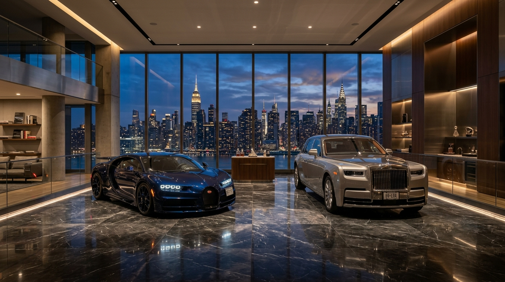

# 💎 Looxmaksing Simulator 2 (Android / Kotlin)

> **Элитный мобильный симулятор бизнеса, инвестиций, суперкаров, футбольного клуба и предметов роскоши на Kotlin & Jetpack Compose.**



## 📱 Особенности игры

- 🏢 **6 Категорий Бизнес-Империи**:
  1. Розничная торговля & Бутики (*Atelier Aurelia & Luxury Retail*)
  2. Рестораны & Отели (*Grand Elysium Michelin Hotels & Resorts*)
  3. Банкинг & Квантовые фонды (*Zurich Private Merchant Bank*)
  4. Строительный холдинг (*Apex Megastructure & Skyscraper Dev*)
  5. IT & Искусственный Интеллект (*Synapse Core AI & Cloud*)
  6. Космическое агентство (*Aether Orbital & Space Agency*)
- 🏎️ **Автомобильный дилерский центр ($40,000)**:
  - Покупка подержанных и аварийных автомобилей на аукционах.
  - Детальная диагностика узлов: двигатель, трансмиссия, подвеска, кузов, салон.
  - Ремонт, детейлинг, тюнинг и перепродажа с максимальной прибылью.
- ⚽ **Футбольный клуб**:
  - Управление составом (Mbappé, Haaland, Vinicius, Bellingham, De Bruyne), тактиками и стадионом.
  - Интерактивная симуляция матчей с комментарием и кубками.
- 📈 **Инвестиции & Биржа**:
  - Реальные акции (AAPL, NVDA, TSLA, RACE Ferrari, MC LVMH).
  - Криптовалютный рынок с волатильностью (BTC, ETH, SOL, LOOX).
  - Элитная недвижимость в Дубае, Нью-Йорке, Монако, Лондоне, Санкт-Морице и Токио.
- 💎 **Предметы Роскоши (Status & Prestige)**:
  - Реальные суперкары: Porsche 911 GT3 RS, Rolls-Royce Phantom VIII, Bugatti Chiron Super Sport 300+, Ferrari SF90 Stradale, Mercedes-AMG G63 Mansory.
  - Частные самолеты: Gulfstream G650ER, Bombardier Global 7500.
  - Мегаяхты: Riva 110 Dolcevita, Lürssen 110m Sovereign.
  - Коллекционные часы: Rolex Daytona, Patek Philippe Nautilus, Richard Mille.
- 🍸 **Приватный клуб (Private Club / Syndicate)**:
  - Разблокируется при достижении 4-го уровня любой компании.
  - Инсайдерские каналы информации, синдикатные сделки и налоговые трасты.

## 📦 Сборка APK и релизы

В репозитории настроен автоматический **GitHub Actions** воркфлоу (`.github/workflows/build-apk.yml`), который компилирует Kotlin код в готовый `.apk` файл и публикует его в разделе **[Releases](https://github.com/kochvalds/kochbratangame2/releases)**.

### Ручная сборка через Gradle:
```bash
cd android
./gradlew assembleDebug
# Готовый APK будет расположен по пути:
# android/app/build/outputs/apk/debug/app-debug.apk
```
